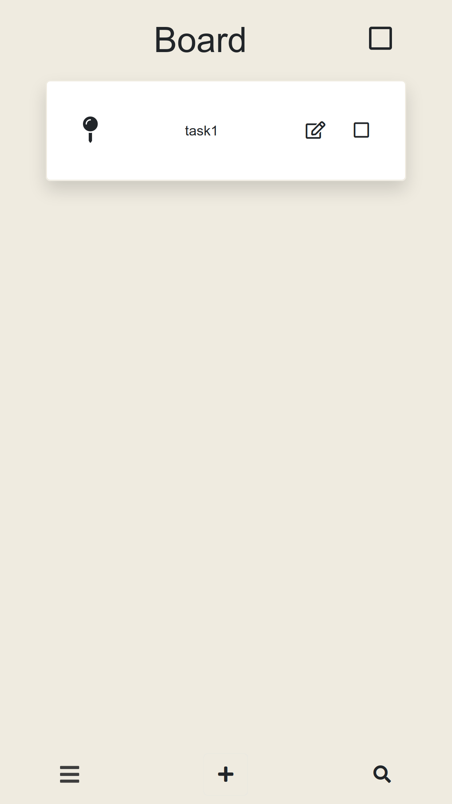
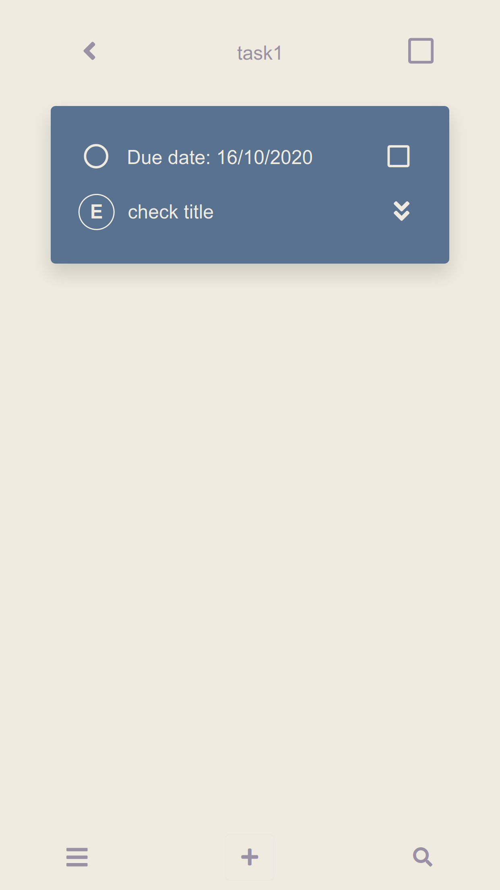

### wireframe 
https://ninjamock.com/s/54N31Gx

### Task plan web app
https://ann7205.github.io/JWD-Final-project/

### How to use it

* Each name card holds tasks, clicking on the name card directly to get to the task list page
* Adding name on the board by clicking '+' icon
* In the task list page, tap '+' icon to add task you want. Selecting the due date, task status, enter name of the task, and the assignee's name. (Defalt setting of status is 'To do')
* For quick updating status, click the button on the task card to change the current status.
* Clicking on square button on the right side of the card for deleting single or multiple cards
* Clicking on the square button on the top of the page to select all list for delete

p.s pin button, search button and menu parts is not available for now.

